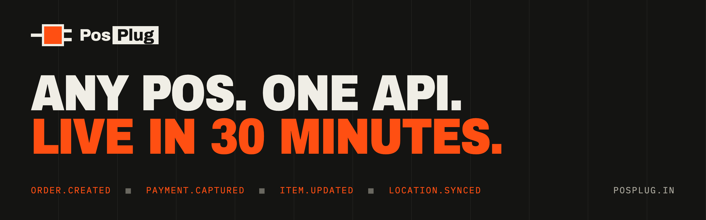

<p align="center">
  
</p>

<p align="center">
  
  
  
  
  
  
</p>

---

# The site

The marketing site for **PosPlug**, an integration layer that maps any
point-of-sale system to one data model and serves it as one REST API plus
webhooks. One page, one stylesheet, one script, served by Cloudflare Pages. No
framework, no bundler, no build step, no runtime dependency. It was designed in
Claude Design ("PosPlug Landing v2") and ported from its React template to
static HTML: every section, the hero patch board, the scroll-driven 30-minute
setup and the code samples are in the HTML, and the script only animates them.

## The rule this site is built around

PosPlug is in early access. The product is being built, so:

- The status strip says **early access**; the first vertical is restaurants.
- The API examples (`api.posplug.in/v1/orders`) show the planned shape of the
  API. `llms.txt` says the endpoint is not public yet.
- Live pricing is **per location, set with early customers**. No numbers.
- The early-access form has no backend yet. A valid form opens a prefilled
  email to `contact@posplug.in` and the page says so. It does not pretend the
  request was stored. The real signup endpoint is tracked in the issues.

When something ships, change it in `index.html` and `llms.txt` together.

## Files

| Path | What it is |
| :--- | :--- |
| `index.html` | The page: hero patch board, 01 problem, 02 the 30-minute connection, 03 how it works, 04 developers, 05 who it's for, 06 spec sheet, 07 security, 08 pricing, access form |
| `assets/posplug.css`, `assets/posplug.js` | The one stylesheet and the one script. The page reads fine with JS off (every setup step is shown, stacked) |
| `404.html` | Cloudflare Pages serves it for unknown paths, so they return 404 instead of the home page with 200 |
| `llms.txt`, `robots.txt`, `sitemap.xml` | Machine-readable summary (status, how it works, API shape, pricing), crawler rules, sitemap |
| `_headers`, `_redirects` | Security and cache headers; `/github` and `/source` short links |

The page head carries the canonical URL, Open Graph and Twitter card tags,
and JSON-LD for `Organization`, `WebSite`, `SoftwareApplication` (with the two
offers) and a short `FAQPage`. It also links `llms.txt` as `rel="alternate"`.

## Brand assets

| File | Use |
| :--- | :--- |
| `assets/favicon.svg` | The mark: cable, orange plug body, two prongs |
| `assets/logo-mark.svg` | The mark on a paper tile. Source for the app icons |
| `assets/icon-512.png`, `assets/apple-touch-icon.png` | App and home-screen icons |
| `assets/og.png` | Open Graph and Twitter card, 1200×630 |
| `assets/readme-banner.png`, `assets/org-avatar.png`, `assets/logo.png` | GitHub only: this README, the organisation profile and a transparent lockup. Not published on the site |

The raster files come from the HTML sources in `tools/`. After changing a source, run:

```sh
tools/render-og.sh   # headless Chrome; writes every PNG above
```

Palette: paper `#D6D5CF`, panel `#E4E3DD`, ink `#141412`, signal orange
`#FF4F12` (hover `#B33600`), status green `#1FA85A` / `#3BE37A`, warning
yellow `#FFC21A`. Type: Archivo, condensed with `font-stretch` (headings,
wordmark), and IBM Plex Mono (everything else). Square corners, 2px ink
borders, hard offset shadows, a 12-column rail grid and film grain.

## Develop

```sh
python3 -m http.server 8787   # serve the repository root; there is nothing to build
```

## Deploy

Merging to `main` publishes nothing: the Pages project `posplug` is
direct-upload. Deploy with:

```sh
tools/deploy.sh             # builds origin/main in a throwaway worktree and deploys it
tools/deploy.sh --dry-run   # builds it and says what would ship
```

Never run `tools/build-dist.sh && wrangler pages deploy dist` from a working
copy. More than one agent session can share a checkout, and that ships whatever
the working copy holds. `build-dist.sh` is an explicit allowlist and stamps
content hashes onto the CSS and JS URLs so they can be cached immutably.

Don't request a new `/assets/*` URL on `posplug.in` before its deploy has
finished. Pages answers a missing asset with the HTML page, and `_headers`
tells the edge to cache `/assets/*.css` and `*.js` for a year. Probe on
`posplug.pages.dev` or use a `?cb=` query instead.
